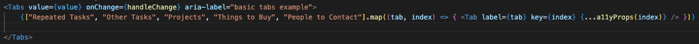

# React Organizer App

## Dependencies 

These are some of the libraries I'm using for this project: 


### Vite
```
npm create vite@latest
```
### React-router-dom
```
npm install react-router-dom localforage match-sorter sort-by

```
### Formik
```
npm install formik --save
```
### MUI
```
npm install @mui/material @emotion/react @emotion/styled
```
### React testing library 
```
npm install --save-dev @testing-library/react
```

This template provides a minimal setup to get React working in Vite with HMR and some ESLint rules.

Currently, two official plugins are available:

- [@vitejs/plugin-react](https://github.com/vitejs/vite-plugin-react/blob/main/packages/plugin-react/README.md) uses [Babel](https://babeljs.io/) for Fast Refresh
- [@vitejs/plugin-react-swc](https://github.com/vitejs/vite-plugin-react-swc) uses [SWC](https://swc.rs/) for Fast Refresh


### Issues I'm trying to figure out

1) I can't get my props to render with the MAP method

Make sure you are writing your Map method expression correclty

This is what I had: 




This is what I needed: 


Basic JS: If you have curly braces, you need a return statement. Or you can omit the curly braces completely. But if you have curly braces, you need to have a return statement, or it is like a function that doesn't return anything (and doesn't render anything on the page)

